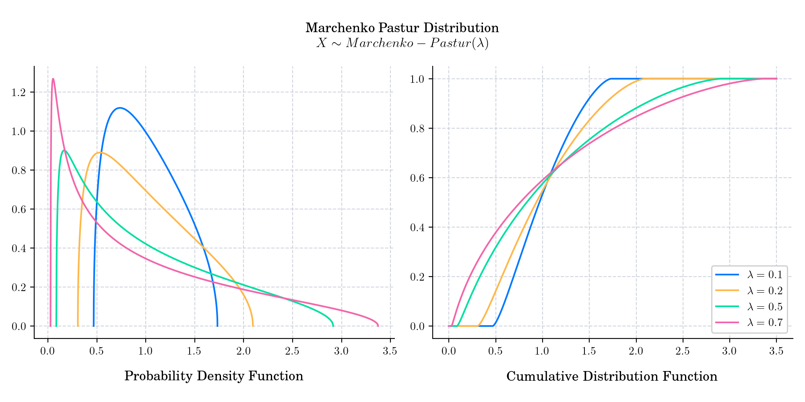
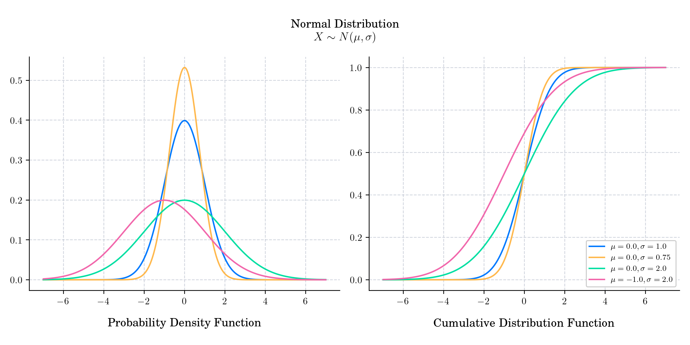
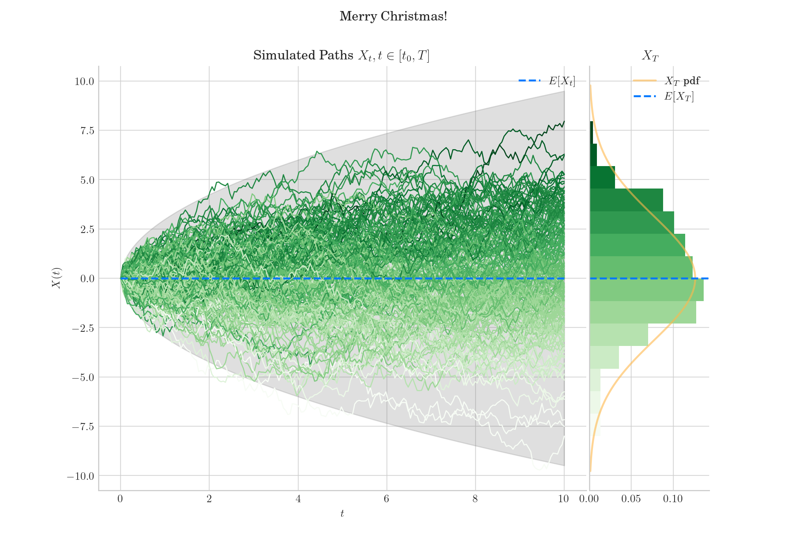

# Advent Calendar 2023

This year I used the countdown to Christmas 🎄 to revisit some probability distributions and shared them in my blog and social networks.
This repo contains the Python scripts to create the images.

For all the submissions visit my [Blog](https://quantgirl.blog/advent-calendar-2023/)

## 1. Binomial

## 2. Beta 

## 3. Cauchy

## 4. Pareto

## 5. Poisson

## 6.  Arc sine

## 7.  Student's t

## 8.  Hypergeometric

## 9.  Gamma

## 10.  Laplace

## 11.  F

## 12.  Chi Squared

## 13.  Exponential

## 14.  Lognormal

## 15.  Chi

## 16.  Von Mises

## 17.  Generalised Extreme Value

## 18.  Wigner Semicircle

## 19.  Zeta

## 20.  Tracy-Widom

 

## 21. Zero-One Inflated Beta

## 22. Marchenko Pastur

## 23.  Two-Piece Normal

## 24.  Normal

