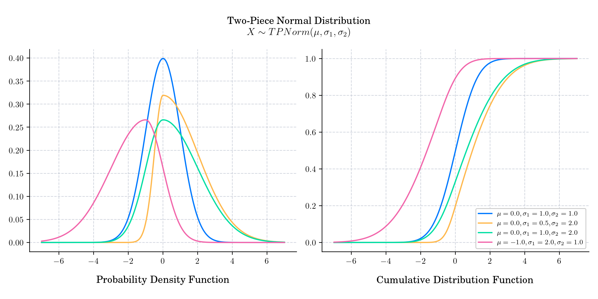

# Advent 2023

This year I used the countdown to Christmas 🎄 to revisit some probability distributions and shared them in my blog and social networks.
This repo contains the Python scripts to create the images.

For all the submissions visit my [Blog](https://quantgirl.blog/advent-calendar-2023/)

1. Binomial

2. Beta 

3. Cauchy

4. Pareto

5. Poisson

6.  Arcsine

7.  Student's t

8.  Hypergeometric

9.  Gamma

10.  Laplace

11.  F

12.  Chi Squared

13.  Exponential

14.  Lognormal

15.  Chi

16.  Von Mises

17.  Generalised Extreme Value

18.  Wigner Semicircle

19.  Zeta

20.  Tracy-Widom

 

21. Zero-One Inflated Beta

22. Marchenko Pastur

23.  Two-Piece Normal

24.  Normal

