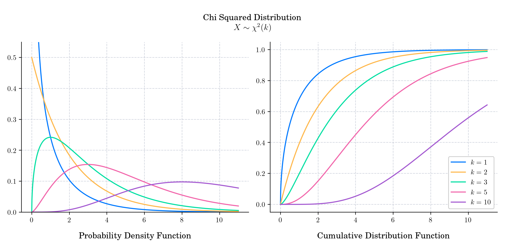

# Advent 2023

This year I will use the countdown to Christmas 🎄 to review some probability distributions and will be sharing them in my blog and social networks.

|                                                   |                                                        |                                                    |
|---------------------------------------------------|--------------------------------------------------------|----------------------------------------------------|
|   |            |      |
|     |         |     |
|  |  |       |
|    |               |  |

For all the submissions visit my [Blog](https://quantgirl.blog/advent-calendar-2023/) 

This repo contains the Python scripts to create the images.

1. Binomial
2. Beta 
3. Cauchy
4. Pareto
5. Poisson
6.  Arcsine
7.  Student's t
8.  Hypergeometric
9.  Gamma
10.  Laplace
11.  F
12.  Chi Squared
13.  Exponential
14.  Lognormal
15.  Chi
16.  Von Mises
17.  Generalised Extreme Value
18.  Wigner Semicircle
19.  Zeta
20.  Tracy-Widom 
21.  Zero-One Inflated Beta
22.  Marchenko Pastur
23.  Two-Piece Normal
24.  Normal

